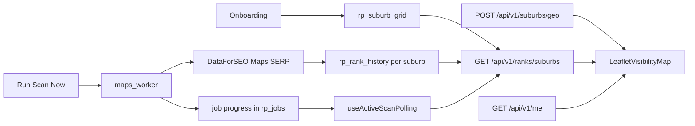

# Leaflet map design — RankPilot visibility map

How suburbs are selected, how DataForSEO rank data reaches the UI, and how **Leaflet** draws each suburb on the visibility map (dashboard + `/map` page).

---

## End-to-end flow

| Step | What happens |
|------|----------------|
| **1. Suburb grid** | Onboarding seeds `rp_suburb_grid` from `METRO_SUBURBS` + radius filter (`au_suburbs.py`). |
| **2. Scan** | Maps scan job → DataForSEO per suburb → **writes each suburb immediately** to `rp_rank_history`. |
| **3. Progress** | Job `result.progress` updates every 2 suburbs; frontend polls and refetches ranks every 5s. |
| **4. Volume sort** | After scan, `rank_priority` reordered by keyword search volume; API returns suburbs sorted by volume. |
| **5. Geo** | `POST /api/v1/suburbs/geo` returns hex GeoJSON from `rp_suburb_geo` (seeded on first request). |
| **6. Map** | Polygons coloured by rank band; circles fallback; competitor pins from `maps_pack` SERP data. |

---

## Rank band → colour

| `rank_position` | Band | Colour |
|-----------------|------|--------|
| 1–3 | Top 3 pack | `#22C55E` |
| 4–10 | Page 1 | `#86EFAC` |
| 11–20 | Page 2 | `#FCD34D` |
| `null` or >20 | Not visible | `#EF4444` |

---

## Key files

| Responsibility | File |
|----------------|------|
| Map (GeoJSON, circles, competitors, legend, scan banner) | `frontend/src/components/map/LeafletVisibilityMap.tsx` |
| Scan polling + live rank refresh | `frontend/src/hooks/useScanPolling.ts` |
| Suburb GeoJSON API | `backend/app/routes/v1/suburbs.py` |
| Geo seed + hex generator | `backend/app/services/suburb_geo_service.py`, `backend/app/lib/suburb_geo.py` |
| Incremental scan writes | `backend/app/workers/maps_worker.py` |
| Volume-sorted suburbs + competitors | `backend/app/services/ranks_service.py` |
| Geo table migration | `infra/sql/015_suburb_geo.sql` |

---

## Suburb shapes

1. **Preferred:** GeoJSON hex polygon from `/api/v1/suburbs/geo` → `L.geoJSON` (react-leaflet `<GeoJSON>`).
2. **Fallback:** population-scaled `L.circle` when geo fetch fails.

Hex boundaries are **approximate** (6-point hex around suburb centre), not official ABS boundaries — same idea as SERPMapper’s circle fallback but drawn as polygons for cleaner overlap (`mix-blend-mode: multiply`).

---

## Competitor pins

Violet **box markers** from `map_competitors` in the ranks API — deduped Maps pack listings with lat/lng from stored SERP snapshots (`feature_snapshot.maps_pack`). Pack position uses `rank_absolute` or list order (not `rank_group`, which is often `1` for every listing). After dedupe, tooltips show a range when the same business ranked differently across suburbs (e.g. `#2–#8 across 12 suburb scans`). **Re-run a Maps scan** to refresh stored positions with the fixed logic.

---

## Live scan updates

1. Dashboard **Run Scan Now** stores `job_id` in `sessionStorage`.
2. `useActiveScanPolling` polls `GET /api/v1/jobs/{id}` every 4s while `queued`/`running`.
3. Ranks query refetches every 5s → map colours update suburb-by-suburb as the worker persists rows.
4. Bottom banner: `Scanning maps pack… 12/25 suburbs`.

---

## Quick reference

| Visual | Implementation |
|--------|----------------|
| Light grey basemap | Carto `light_all` tile layer |
| Coloured suburb shapes | GeoJSON hex **or** circle + rank colour |
| Blue business pin | `L.marker` default icon |
| Grey competitor dots | `CircleMarker` + tooltip |
| Bottom-left legend | React overlay + competitor note |
| Scan progress pill | `scanProgress` prop while job running |

---

_Primary map component: `frontend/src/components/map/LeafletVisibilityMap.tsx`_
